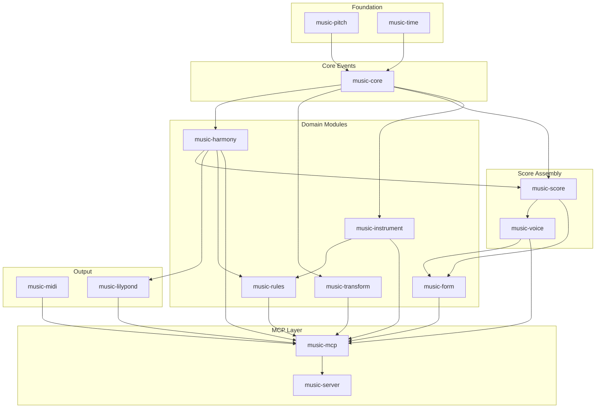
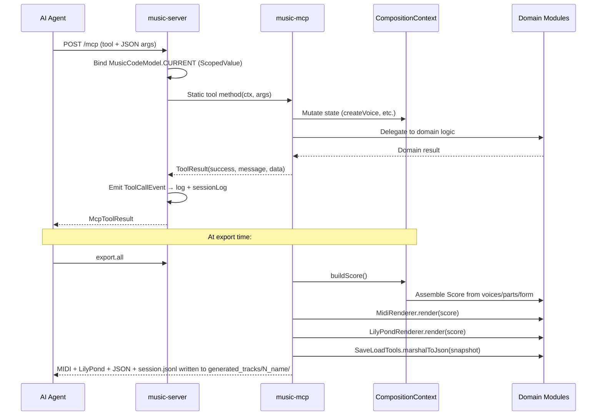

# Codebase Map

> Auto-generated by Cartographer. Last mapped: 2026-04-17

## System Overview

music.build is a Java 25, JPMS-modular library that treats musical composition as typed, immutable, AI-accessible data. The thesis: music is hierarchical composition of typed parts (note → motif → phrase → section → piece) and should be programmable, queryable, and structurally editable — not just playable.

The system exposes 52 MCP tools through a JSON-over-HTTP server, allowing AI agents to compose music by building typed structures via the tool surface.

All major domain objects extend `AbstractTraitable` from `build.codemodel.foundation`. Each object is a bag of `Trait` instances; factories call `MusicCodeModel.current()` via a `ScopedValue` to resolve the ambient type registry.



## Directory Structure

```
music.build/
├── music-pitch/          # Foundation: note names, accidentals, spelled pitches, intervals
├── music-time/           # Foundation: durations, fractions, time signatures, tempo
├── music-core/           # NoteEvent sealed hierarchy (Note/Rest/Chord), velocity, articulation
├── music-score/          # Voice, Part, Score — the composition container
├── music-voice/          # VoiceOperations static utilities (concat, slice, merge)
├── music-transform/      # Serial/motivic transforms: transpose, invert, retrograde, augment
├── music-harmony/        # Scales, keys, chord progressions, Roman numerals, harmonizer
├── music-instrument/     # Instrument catalog, ranges, ensembles
├── music-rules/          # Compositional validation: meter, voice leading, parallel motion, range
├── music-form/           # Formal structure: sections, repeats, volta, FormalPlan → Score
├── music-midi/           # MIDI render/write/read/play (javax.sound.midi)
├── music-lilypond/       # LilyPond source generation + subprocess engraving
├── music-mcp/            # CompositionContext + all 55 MCP tool implementations
├── music-server/         # Thin JSON adapter wiring music-mcp to the MCP HTTP server
├── music-demo/           # End-to-end demo: Ode to Joy with all transforms
├── skills/music-composition/SKILL.md  # Primary AI agent reference for tool usage
├── skills/music-extend/SKILL.md       # Developer reference for extending drum presets/tools
├── docs/                 # Master plan, milestone prompts, NOTES.md, ROADMAP.md, design specs
└── pom.xml               # Multi-module Maven build, Java 25
```

## Module Guide

### music-pitch

**Purpose**: Foundation layer for pitch representation with zero internal dependencies.
**Entry point**: `build.music.pitch` package; `build.music.pitch.typesystem` for `MusicCodeModel`
**Key files**:
| File | Purpose |
|------|---------|
| SpelledPitch.java | Primary concrete pitch: (NoteName, Accidental, OctaveTrait) as AbstractTraitable |
| SpelledInterval.java | Typed interval with IntervalQuality + IntervalSize + IntervalDirection as traits |
| Enharmonic.java | Enharmonic equivalence + simplification utilities |
| NoteName.java | C D E F G A B enum-as-Trait with semitone navigation |
| Accidental.java | DOUBLE_FLAT through DOUBLE_SHARP; ±2 semitones |
| PitchClass.java | 12 chromatic classes (always sharp-spelled) |
| IntervalQuality.java | dim/min/perf/maj/aug with quality/size validation |
| IntervalDirection.java | ASCENDING / DESCENDING; stored in SpelledInterval but ignored in equals |
| OctaveTrait.java | @Singular record carrying octave number as a separate queryable trait |
| typesystem/MusicCodeModel.java | ScopedValue<MusicCodeModel> CURRENT; binds ambient type registry per session |

**Exports**: `build.music.pitch`, `build.music.pitch.typesystem`

**Key gotchas**:
- `SpelledPitch.intervalTo()` always computes ascending intervals within one octave — cannot compute descending or compound intervals
- `SpelledInterval.simple()` is a stub that returns `this` — compound intervals are not reduced
- `PitchClass` always spells black keys with sharps (CS, DS, FS, GS, AS) — no flat PitchClass members
- `Enharmonic.areEnharmonic(a, b)` returns false if `a.equals(b)` — a pitch is never enharmonic with itself
- Every `of(...)` factory calls `MusicCodeModel.current()` at construction; code outside a ScopedValue binding silently uses the static fallback singleton

---

### music-time

**Purpose**: Rhythmic and temporal primitives — durations, fractions, time signatures, tempo, metric positions, tuplets, tempo changes. Zero internal dependencies.
**Entry point**: `build.music.time` package
**Key files**:
| File | Purpose |
|------|---------|
| Fraction.java | Exact rational arithmetic, auto-reduces to lowest terms; no overflow guard |
| Duration.java | Interface trait: fraction() + absolute(Tempo); not sealed (cross-module subtypes exist) |
| RhythmicValue.java | WHOLE through SIXTY_FOURTH enum-as-Duration; symbol codes w h q e s t x |
| DottedValue.java | 1–3 dots extension of RhythmicValue |
| Tuplet.java | Tuplet duration: actual/normal/unit |
| ScaledDuration.java | Package-private Duration from Augment transform (arbitrary Fraction) |
| Tempo.java | BPM + beat unit; wall-clock Duration conversion via durationOf(Fraction) |
| TempoChange.java | Gradual tempo ramp (linear or quadratic; "exponential" label is misleading — it's t²) |
| TimeSignature.java | beats/beatUnit; measureDuration; isCompound() |
| MetricPosition.java | (measure, beatOffset); 0-based measure; isDownbeat() |

**Key gotchas**:
- `TimeSignature.isCompound()` only matches 8th-beat-unit meters (6/8, 9/8, 12/8) — 6/4 is classified simple
- `TempoChange` "exponential" curve is actually quadratic ease-in (t²), not a true exponential
- `Duration` is intentionally NOT sealed — `ScaledDuration` (music-transform) and `FractionDuration` (music-midi) are permitted types from other JPMS modules
- After `Augment`, all durations become `ScaledDuration` — code that does `instanceof RhythmicValue` will fall through

---

### music-core

**Purpose**: Musical event types combining pitch + duration + performance semantics.
**Entry point**: `build.music.core` package — central exchange type is `NoteEvent` (sealed interface)
**Dependencies**: music-pitch, music-time
**Key files**:
| File | Purpose |
|------|---------|
| NoteEvent.java | Sealed interface: permits Note, Rest, Chord; single method duration() |
| Note.java | AbstractTraitable holding SpelledPitch, Duration, Velocity, Articulation, optional TiedMarker |
| Rest.java | AbstractTraitable holding only a Duration trait |
| Chord.java | AbstractTraitable with multiple SpelledPitch traits; sorted ascending by MIDI at construction |
| ChordSymbol.java | Harmonic label (NoteName + Accidental + ChordQuality); parse/toString; toPitches(octave) |
| ChordQuality.java | 13 chord types (MAJOR through SUS4) with interval lists; creates new SpelledInterval on each call |
| Velocity.java | @Singular record 0–127 with named constants PPP–FFF |
| Articulation.java | @NonSingular enum; 8 articulations with durationFactor() |
| TiedMarker.java | Presence-based boolean: INSTANCE present = note is tied |
| OrderTrait.java | Preserves Chord pitch ordering for marshalling round-trip |

**Key gotchas**:
- `Chord.root()` returns lowest MIDI pitch, NOT the harmonic root — first inversion C major returns E
- `Chord.inversion()` always returns 0 (documented stub)
- `ChordSymbol.transpose()` uses octave 4 as scratch; discards octave info
- `ChordQuality.intervals()` creates new `SpelledInterval` objects on every call — not memoized
- Sealed `NoteEvent` enables exhaustive Java 21+ switch pattern matching in consumers

---

### music-score

**Purpose**: Top-level composition container — Voice (event sequence), Part (Voice + MIDI routing), Score (complete composition).
**Entry point**: `build.music.score.Score`, `Score.Builder`
**Dependencies**: music-pitch, music-time, music-core, music-harmony (for Key as Trait)
**Key files**:
| File | Purpose |
|------|---------|
| Score.java | AbstractTraitable: title, TimeSignature, Tempo, Key (nullable), Parts, SwingRatioTrait, BarChordsTrait, TempoChangesTrait, StructuredVoicesTrait |
| Voice.java | AbstractTraitable + Trait: (VoiceNameTrait, EventSequenceTrait); fundamental event sequence |
| Part.java | AbstractTraitable + Trait: (name, channel, program, embedded Voice) |
| StructuredVoice.java | Notation-only volta structure (Plain/Volta segments); produced by FormalPlan.toScore() |
| NoteEventList.java | Marshalling adapter for List<List<NoteEvent>> inside Volta endings |
| BarChordPair.java | Marshalling adapter for Map<Integer, ChordSymbol> entries |

**Key gotchas**:
- `Score.barChords()` can be null (unlike tempoChanges/structuredVoices which default to List.of()); always null-check
- `Part.piano()` and `Part.strings()` both hardcode `midiChannel = 0`; multi-instrument scores need explicit channel assignment
- `Score` depends on `music-harmony.Key` — these modules cannot be separated

---

### music-voice

**Purpose**: Higher-level operations on Voice objects — concat, slice, merge, split by measure, pad with rests.
**Entry point**: `build.music.voice.VoiceOperations` (all static), `MeasureSlice`
**Dependencies**: music-pitch, music-time, music-core, music-score
**Key files**:
| File | Purpose |
|------|---------|
| VoiceOperations.java | concat, repeat, slice, sliceMeasures, merge, splitByMeasure, padToMeasure, measureCount |
| MeasureSlice.java | Read-only view of one measure's events; completeness check via isComplete(TimeSignature) |

**Key gotchas**:
- `toBarredString()` is a stub — bar lines are never actually inserted
- `merge()` assumes no overlapping notes (monophonic voices only; documented)
- `padToMeasure()` fills only down to SIXTEENTH; sub-sixteenth positions leave a remainder
- `sliceMeasures()` does NOT split notes that straddle a measure boundary — the event is included whole
- `MeasureSlice.totalDuration` is caller-supplied and not validated against the actual event sum
- `MeasureSlice.pitches()` excludes Chord events (only captures Note instances)

---

### music-transform

**Purpose**: Composable melodic and pitch transforms — the classic 12-tone operations.
**Entry point**: `build.music.transform.Transforms` (combinators), individual transform records
**Dependencies**: music-pitch, music-time, music-core
**Key files**:
| File | Purpose |
|------|---------|
| Transform.java | Generic functional interface: apply(T) → T; andThen/repeat combinators |
| PitchTransform.java | Marker sub-interface for Pitch-level transforms (Transpose, Invert) |
| MelodicTransform.java | Marker sub-interface for List<NoteEvent>-level transforms (Retrograde, Augment) |
| Transforms.java | compose(), transposePitches(), retrogradeInversion() — static combinators |
| Transpose.java | Chromatic transposition up or down by SpelledInterval |
| Invert.java | Melodic inversion around an axis pitch using name-step mirroring |
| Retrograde.java | Temporal reversal (reverses order only, not durations) |
| Augment.java | Duration scaling by rational factor → produces ScaledDuration |

**Key gotchas**:
- After `Augment`, all durations become `ScaledDuration` (not RhythmicValue) — code that pattern-matches `instanceof RhythmicValue` falls through
- `Transforms.retrogradeInversion()` applies Retrograde first, then Invert per note (not RI in that label order)
- `Transforms.retrogradeInversion()` passes Chord events through without inverting pitches
- `Invert` uses name-step mirroring that can produce double-sharp/flat spellings for pitches far from the axis
- `Voice.transform()` takes `UnaryOperator<List<NoteEvent>>` — not `MelodicTransform` — due to module dependency constraints

---

### music-harmony

**Purpose**: Full tonal music theory engine — scales, keys, chord progressions, diatonic transposition, harmonic analysis, accompaniment generation.
**Entry point**: `build.music.harmony` package
**Dependencies**: music-pitch, music-time, music-core
**Key files**:
| File | Purpose |
|------|---------|
| Key.java | AbstractTraitable + @Singular Trait: tonic + ModeTrait; relative/parallel/dominant/subdominant navigation |
| Scale.java | AbstractTraitable: root + ScaleType; pitches(octave), degree(n, octave), contains, degreeOf |
| ScaleType.java | Interval pattern database: 15 scale types (major, modes, pentatonic, blues, chromatic, whole-tone) |
| Harmonizer.java | harmonize/walkingBass/comp/suggestHarmony — all static; 4/4-centric |
| HarmonicAnalyzer.java | detectKey (Krumhansl-Schmuckler correlation), analyze, findProgression |
| RomanNumeral.java | AbstractTraitable: ScaleDegree + ChordQuality + optional InvertedMarker; parse/chordInKey |
| ChordProgression.java | Ordered RomanNumeral list; factory presets (I-IV-V-I, ii-V-I, 12-bar blues, etc.) |
| DiatonicTranspose.java | Step-wise transposition within a Key; throws for non-diatonic pitches |
| KeySignature.java | Thin notation wrapper around Key; toLilyPond() |

**Key gotchas**:
- `Key.scale()` always uses NATURAL_MINOR — harmonic/melodic minor requires explicit Scale construction
- `HarmonicAnalyzer.detectKey()` always spells black keys as sharps; Bb major may be returned as A# major
- `Harmonizer.harmonize()` always emits whole notes regardless of time signature (documented limitation)
- `Harmonizer.walkingBass()` is primarily designed for 4/4; other meters fall back to simpler patterns
- `RomanNumeral.parse()` recognizes `bVII` flat prefix but does NOT apply it when resolving chordInKey — borrowed chords resolve to the diatonic degree
- `DiatonicTranspose` silently passes Chord events through unchanged (does not transpose chord pitches)
- `Key.dominant()` and `Key.subdominant()` always return major keys regardless of source mode

---

### music-instrument

**Purpose**: Instrument metadata catalog — ranges, MIDI programs, articulations, ensembles.
**Entry point**: `build.music.instrument.Instruments` (23 entries), `Ensemble`
**Dependencies**: music-pitch, music-core, music-time
**Key files**:
| File | Purpose |
|------|---------|
| Instruments.java | Static catalog: 23 orchestral instruments; byName/byMidiProgram/byFamily/all |
| Instrument.java | AbstractTraitable: name, InstrumentFamily, writtenRange, comfortableRange, midiProgram, articulations, TransposingMarker |
| PitchRange.java | AbstractTraitable: (LowPitchTrait, HighPitchTrait); contains/isComfortable |
| Ensemble.java | AbstractTraitable + plain List<Instrument>: STRING_QUARTET, WOODWIND_QUINTET, BRASS_QUINTET, PIANO_TRIO, STRING_ORCHESTRA |
| InstrumentFamily.java | @Singular enum Trait: WOODWIND BRASS STRING KEYBOARD PERCUSSION VOCAL |
| TransposingMarker.java | Presence-only @Singular enum Trait: INSTANCE |

**Key gotchas**:
- `transposing = true` does NOT mean `transposition` interval field is non-null — all catalog instruments have `transposition = null`
- `byMidiProgram()` returns first match only; Trombone(57) wins over Bass Trombone(57)
- `canPlay()` silently skips Chord events — chord voicings are never range-checked
- STRING_QUARTET holds two references to the same `VIOLIN` singleton object

---

### music-rules

**Purpose**: Advisory compositional validation — never throws, always accumulates `Violation` records.
**Entry point**: `build.music.rules.RuleSet` with factory presets
**Dependencies**: music-pitch, music-time, music-core, music-score, music-instrument, music-harmony
**Key files**:
| File | Purpose |
|------|---------|
| RuleSet.java | Aggregates Rules; check(Voice) + checkScore(Score); presets: orchestration/counterpoint/basic |
| Rule.java | Interface: check(Voice, name) + checkPair(Voice, Voice) |
| Violation.java | (ruleName, severity, message, noteIndex, voiceName); severities: error/warning/suggestion |
| MeterRule.java | Validates measure completeness against TimeSignature; resets on overflow |
| VoiceLeadingRule.java | Flags large leaps, tritones (by MIDI semitone), repeated pitches |
| ParallelMotionRule.java | Detects parallel 5ths/8ths between voice pairs by MIDI modulo 12 |
| RangeRule.java | Checks notes against instrument writtenRange/comfortableRange |

**Key gotchas**:
- `ParallelMotionRule` silently skips voice pairs with different event counts — rhythmically independent counterpoint is entirely unchecked
- `MeterRule` resets cursor on overflow, preventing cascade errors but potentially masking later problems
- `VoiceLeadingRule` cannot detect augmented seconds — operates on MIDI semitone arithmetic only
- `RuleSet.orchestration()` maps instrument assignments by voice name; parts not in the map get no range rule

---

### music-form

**Purpose**: Musical form management — named sections, repetition, volta endings, FormalPlan → Score assembly.
**Entry point**: `build.music.form.FormBuilder` (fluent builder)
**Dependencies**: music-pitch, music-time, music-core, music-score, music-voice
**Key files**:
| File | Purpose |
|------|---------|
| FormalPlan.java | Ordered Section list → toScore(midiPrograms); handles endings, rest-fill, StructuredVoice |
| FormBuilder.java | Fluent builder: section/repeatSection/setEnding/setSectionBarChords/build |
| Section.java | AbstractTraitable: name, label, measureCount, TimeSignature, voices (Map), endings (Map<pass, Section>) |
| SectionVoicePair.java | @NonSingular marshalling adapter for Map<String, Voice> entries |
| SectionEndingPair.java | @NonSingular marshalling adapter for Map<Integer, Section> endings |

**Key gotchas**:
- `FormBuilder.setEnding()` REMOVES the ending section from the play sequence (it is subsumed into the main section's ending map)
- `FormalPlan.trimToMeasures()` cannot split a single event at a measure boundary — voice content must be metrically aligned
- `buildRestVoice()` silently drops sub-sixteenth remainder durations
- `Section.voices()` reconstructs the Map from traits on every call — no caching
- `FormalPlan.toScore()` assigns channels sequentially modulo 16; more than 15 melodic voices causes channel collisions; channel 9 (drums) is not automatically avoided
- Voices absent from a section get auto-generated rest voices of the correct duration

---

### music-midi

**Purpose**: MIDI I/O — render Score to `javax.sound.midi.Sequence`, write/read SMF files, play through system synthesizer.
**Entry point**: `build.music.midi.MidiRenderer`, `MidiWriter`, `MidiReader`, `MidiPlayer`
**Dependencies**: music-pitch, music-time, music-core, music-score, java.desktop
**Key files**:
| File | Purpose |
|------|---------|
| MidiRenderer.java | Score → Sequence; handles ties (pre-pass), swing, articulation durationFactor, per-bar tempo changes |
| MidiWriter.java | Sequence → SMF type 1 file via MidiSystem.write() |
| MidiReader.java | SMF → MidiImport(List<Voice>, Tempo); always spells black keys as sharps; monophonic per track |
| MidiPlayer.java | AutoCloseable; blocking play() via CountDownLatch on end-of-track meta event |
| GeneralMidi.java | GM program number constants + DRUM_CHANNEL = 9 |
| FractionDuration.java | Package-private Duration adapter for MidiReader round-trip (arbitrary Fraction) |

**Constants**: TICKS_PER_QUARTER = 480

**Key gotchas**:
- `MidiReader` always spells black keys as sharps — flat spellings are lost on read-back
- `MidiPlayer.play()` blocks until end-of-track meta event — will hang if the event is missing
- Swing applies only to single eighth `Note` events (duration exactly Fraction.EIGHTH); Chords are never swung
- `MidiReader` is monophonic per track — simultaneous notes in a track are sequentialized
- `MidiReader` snaps unusual tick durations to nearest standard value; exotic rhythms fall through to exact rational
- Gradual tempo changes are implemented as one `0x51` MetaMessage per bar (not true MIDI tempo automation)

---

### music-lilypond

**Purpose**: Converts the music object model to LilyPond `.ly` source, and invokes the `lilypond` CLI to engrave PDF/PNG.
**Entry point**: `build.music.lilypond.LilyPondRenderer` (static), `LilyPondEngraver` (subprocess wrapper)
**Dependencies**: music-pitch, music-time, music-core, music-score, music-harmony
**Key files**:
| File | Purpose |
|------|---------|
| LilyPondRenderer.java | Score → LilyPond source text; handles volta (StructuredVoice), ChordNames staff, clef, key, tuplets |
| LilyPondEngraver.java | Subprocess wrapper: engravePdf/engravePng/isAvailable; probes three binary locations |

**Key gotchas**:
- LilyPond is a hard external dependency — always call `LilyPondEngraver.isAvailable()` before engraving
- `\midi {}` is always emitted in the `.ly` source, so engraving also produces a `baseName.midi` side-effect file
- Tuplet grouping is purely fraction-based — all consecutive same-fraction events are bracketed together, ignoring beat boundaries
- `renderDuration()` approximates unknown fractions — may produce invalid LilyPond for exotic durations
- Clef selection is a heuristic: treble if average MIDI ≥ 60, else bass
- Temporary `.ly` files are not cleaned up after engraving
- `findExecutable()` runs a subprocess on each engraving call (no caching)
- `KeySignature.toLilyPond()` has dead-code in the flat special-case switch — all branches yield `"es"`

---

### music-mcp

**Purpose**: All 52 MCP tool implementations + `CompositionContext` (session state) + `ToolResult`. Zero MCP protocol knowledge — pure business logic callable from tests.
**Entry point**: `build.music.mcp.CompositionContext` + tool classes in `build.music.mcp.tools`
**Dependencies**: All other music-* modules + java.desktop

**Key files**:
| File | Purpose |
|------|---------|
| CompositionContext.java | Single mutable session state; voices, motifs, parts, dynamics, articulation ranges, form state, session log |
| CompositionSnapshot.java | Immutable marshallable snapshot: schemaVersion 2.0.0, Score, List<MotifSnapshot> |
| MotifSnapshot.java | (name, List<NoteEvent>) for snapshot serialization |
| MusicMarshalling.java | JSON transport factory for save/load; wires codemodel name transformers |
| ToolResult.java | record(success, message, data); data is non-null only for export.lilypond |
| tools/CreateNoteTools.java | Note DSL parser/formatter: pitch/duration tokens, chord brackets, articulation/tie/velocity suffixes |
| tools/VoiceTools.java | voice.create/append/from_motif/set_dynamics/set_articulation/list |
| tools/VoiceOpTools.java | voice.concat/repeat/slice/pad_to_measure/delete |
| tools/ScoreTools.java | score.set_metadata/assign_instrument/set_swing/set_tempo_change/describe/clear |
| tools/TransformTools.java | transform.transpose/invert/retrograde/augment + motif.save |
| tools/HarmonyTools.java | harmony.set_key/chord_progression/set_bars/harmonize/suggest_harmony/detect_key/diatonic_transpose/walking_bass/comp |
| tools/FormTools.java | form.create_section/repeat_section/set_ending/build/describe |
| tools/QueryTools.java | query.voice/motif/note_at |
| tools/ExportTools.java | export.midi/lilypond/play/all (writes MIDI + .ly + .json + session.jsonl to generated_tracks/) |
| tools/RulesTools.java | rules.check/check_range |
| tools/InstrumentTools.java | instrument.info/suggest |
| tools/SaveLoadTools.java | score.save/score.load (JSON snapshot via codemodel marshalling) |
| tools/DrumPresets.java | drums.preset — 8 drum patterns: house_4on4, rock_8th, rock_basic, bossa_nova, waltz, waltz_jazz, swing, afrohouse |

**CompositionContext key fields**:
- `voices` — `LinkedHashMap<String, List<NoteEvent>>` (insertion order preserved)
- `motifs` — `LinkedHashMap<String, List<NoteEvent>>` (named patterns)
- `partAssignments` — `LinkedHashMap<String, PartAssignment>` (channel + program per voice)
- `voiceDynamics` / `voiceArticulations` — global per-voice defaults
- `voiceArticulationRanges` — bar-scoped articulation overrides (non-overlapping ranges enforced)
- `formBuilder` — nullable; initialized when `form.create_section` is first called
- `barChords` — `LinkedHashMap<Integer, ChordSymbol>` (1-based bar numbers)
- `structuredVoices` — populated by `form.build`; used by LilyPond for volta rendering
- `sessionLog` — append-only list of JSONL strings; flushed to `session.jsonl` by `export.all`

**Tool count by category** (55 total):
| Category | Tools |
|---|---|
| Voice management | `voice.create/append/from_motif/set_dynamics/set_articulation/list` |
| Voice operations | `voice.concat/repeat/slice/pad_to_measure/delete` |
| Score config | `score.set_metadata/assign_instrument/set_swing/set_tempo_change/describe/clear/save/load` |
| Transforms | `transform.transpose/invert/retrograde/augment` + `motif.save` |
| Harmony | `harmony.set_key/chord_progression/set_bars/harmonize/suggest_harmony/detect_key/diatonic_transpose/walking_bass/comp` |
| Query | `query.voice/motif` |
| Export | `export.midi/lilypond/all` |
| Form | `form.create_section/repeat_section/set_ending/build/describe` |
| Rules | `rules.check/check_range` |
| Instrument | `instrument.info` |
| Drums | `drums.preset` |

**Critical design notes**:
- All tool methods are `static (CompositionContext ctx, ...) -> ToolResult`
- `CompositionContext` is one instance per server process — not thread-safe, single-user only
- All transform tools create NEW voices by default; originals are untouched (pass same name as targetVoice to overwrite)
- `form.build` replaces voice event lists in-place by name after FormalPlan assembly — original per-section voices are gone
- `score.save`/`score.load` round-trip through codemodel JSON marshalling; `MusicCodeModel` must be bound before unmarshal
- `restoreFrom(snapshot)` does NOT restore voiceDynamics/voiceArticulations — those are baked into note events

**Key gotchas**:
- `Chord` events pass through pitch transforms (invert/transpose) unchanged — documented limitation
- Percussion voices (channel 9) skip `rules.check` but NOT transform tools — transforms on drum voices produce nonsense
- `harmonize` always emits whole notes regardless of time signature
- `harmony.set_bars` must be called BEFORE `form.create_section` for bar chords to be captured per section
- `score.set_tempo_change` direction label (ritardando/accelerando) compares to global base tempo, not the BPM at startBar
- `setBarChords()` has no error handling for non-integer bar numbers; throws uncaught NumberFormatException
- `export.all` folder numbering counts existing directories at call time — no collision protection

---

### music-server

**Purpose**: Thin JSON adapter — wires `music-mcp` static methods to MCP HTTP protocol. Zero music logic.
**Entry point**: `build.music.server.MusicMcpServer` + `main()`
**Dependencies**: music-mcp, build.serve.mcp, build.serve.application, build.base.network
**Key files**:
| File | Purpose |
|------|---------|
| MusicMcpServer.java | configure() registers all 55 tools; JSON arg extraction helpers; two event subscribers |

**Build & run**: `./mvnw exec:java -pl music-server` — starts server on port 3000 (hardcoded).

**Event subscribers** attached to `mcp.toolCallEvents()`:
1. **Logging subscriber**: INFO on success (with duration), WARNING on failure, via System.Logger
2. **Session log subscriber**: serializes each call to a JSON line `{ts, tool, args, durationMs, ok, error?}` and stores in `ctx.addSessionLogLine()`

**Key gotchas**:
- Port 3000 is hardcoded — no env var/config override
- Single `CompositionContext` instance shared across all MCP requests (no per-session isolation)
- `export.play` tool blocks the server handler thread for the duration of playback
- Session log lines accumulate in memory in `ctx` until `export.all` is called — no automatic flush

---

### music-demo

**Purpose**: End-to-end demonstration — Ode to Joy with all 5 serial/motivic transforms, MIDI playback, optional LilyPond engraving.
**Entry point**: `build.music.demo.OdeToJoy.main()`

Applies: transposition (m3 up), retrograde, inversion (around E4), augmentation (doubling), retrograde inversion. Gracefully degrades when MIDI/LilyPond unavailable. Output files go to process CWD and `output/`.

---

## Data Flow



## Conventions

**Code style:**
- Java 25, all JPMS modules with explicit `module-info.java`
- Domain objects extend `AbstractTraitable` from `build.codemodel.foundation`; all properties stored as `Trait` instances
- `@Singular` on a Trait = at most one per owner; `@NonSingular` = multiple allowed
- Factory methods (`Foo.of(...)`) read `MusicCodeModel.current()` via `ScopedValue` — must be called inside a binding
- Scalars (`Fraction`, `Velocity`, `Tempo`) and enums stay as records/enums implementing `Trait` directly
- Sealed interfaces for discriminated unions (`NoteEvent permits Note, Rest, Chord`)
- Static utility classes (private no-arg constructor) for algorithms
- Parse-what-you-print: all value types with string representation implement `parse(String)` and `toString()` that round-trip
- Marshalling via `@Marshal`/`@Unmarshal` annotations on destructor/constructor; `Marshalling.register()` in static initializer

**Build:**
- `./mvnw` (always use the wrapper, never bare `mvn`)
- Maven multi-module, groupId `build.music`, version `0.1.0-SNAPSHOT`
- Java 25 compiler source/target throughout; Checkstyle at validate phase

**Testing:**
- JUnit Jupiter; tests in each module under `src/test/java`
- MCP tool tests in `music-mcp/src/test/` use real `CompositionContext` inside `ScopedValue` binding — no mocks

**Musical conventions:**
- Octave numbering: C4 = middle C = MIDI 60 (Scientific Pitch Notation)
- Fractions always reduce to lowest terms (Fraction auto-reduces)
- All rhythmic quantities are fractions of a whole note
- `TICKS_PER_QUARTER = 480` in MIDI output

## Gotchas

**Architecture:**
- `music-score` depends on `music-harmony.Key` — these modules cannot be separated
- Single `CompositionContext` per process — no multi-user/multi-session support (by design; see README)
- `form.build` destroys individual section voices in-place (replaces with assembled voice by name)
- `Duration` cannot be sealed because subtypes (`ScaledDuration`, `FractionDuration`) live in separate JPMS modules

**Pitch:**
- `SpelledPitch.intervalTo()` only computes ascending intervals within one octave
- `HarmonicAnalyzer.detectKey()` always returns sharp-spelled keys (Bb may come back as A#)
- `Chord.root()` is lowest MIDI pitch, not harmonic root
- Every `of(...)` factory silently falls back to a static MusicCodeModel if called outside a ScopedValue binding

**Rendering:**
- LilyPond tuplet detection groups ALL consecutive same-fraction events — may over-bracket
- `Harmonizer.harmonize()` always outputs whole notes regardless of time signature
- `MidiReader` always spells black keys as sharps on read-back
- Swing only applies to single eighth `Note` events, not Chords
- Engraving with LilyPond always produces a side-effect `.midi` file (due to `\midi {}` in every rendered source)

**Tool surface:**
- `assignChannel()` is not idempotent — repeated `score.assign_instrument` on same voice may change channel
- `harmony.set_bars` must be called BEFORE `form.create_section` for bar chords to be captured per section
- Session log only flushes on `export.all`; use `score.save` to checkpoint state independently

## Navigation Guide

**To add a new MCP tool:**
1. Add the static method to the appropriate tool class in `music-mcp/src/main/java/build/music/mcp/tools/`
2. Register it in `MusicMcpServer.configure()` in `music-server/src/main/java/build/music/server/MusicMcpServer.java`
3. Add a test in `music-mcp/src/test/`
4. Document it in `skills/music-composition/SKILL.md`

**To add a new drum preset:**
1. Add `oneBarXxx()` method in `DrumPresets.java`
2. Wire into `oneBar()` switch and update `available()` set
3. Update `MusicMcpServer.java` tool description
4. Document in `skills/music-composition/SKILL.md`
See also `skills/music-extend/SKILL.md` for full step-by-step.

**To add a new musical domain type:**
- Foundation types (no internal deps): add to `music-pitch` or `music-time`
- Event types: add to `music-core` (or extend `NoteEvent` sealed hierarchy)
- Tonal/key-aware: add to `music-harmony`
- Output-specific: add to `music-midi` or `music-lilypond`

**To modify score assembly:**
- Score structure: `music-score/src/main/java/build/music/score/Score.java`
- Form-based assembly: `music-form/src/main/java/build/music/form/FormalPlan.java` → `toScore()`
- MCP context assembly: `music-mcp/src/main/java/build/music/mcp/CompositionContext.java` → `buildScore()`

**To debug a voice that sounds wrong:**
1. `query.voice` to inspect events and bar structure
2. `rules.check` to validate meter and voice leading
3. `export.lilypond` to see notation (if LilyPond available)
4. Check for augmented voices (ScaledDuration vs RhythmicValue after augment transform)

**To run tests:**
```bash
./mvnw test
./mvnw test -pl music-mcp          # just MCP tests
./mvnw test -pl music-harmony      # just harmony tests
```

**To run the server:**
```bash
./mvnw exec:java -pl music-server
```

If cartographer helped you, consider starring: https://github.com/kingbootoshi/cartographer - please!
