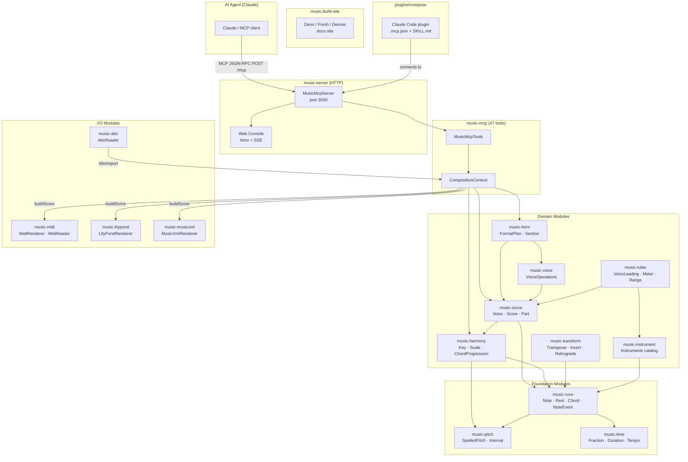

# Codebase Map

> Auto-generated by Cartographer. Last mapped: 2026-05-04

## System Overview

music.build is a Java 25, JPMS-modular library and MCP server that exposes 47 tools for AI-assisted music composition. All composition state lives in a single in-process `CompositionContext`; the server is single-user by design.


```mermaid
graph TB
    subgraph AI["AI Agent (Claude)"]
        Claude[Claude / MCP client]
    end
    subgraph Server["music-server (HTTP)"]
        HTTP[MusicMcpServer\nport 3000]
        Console[Web Console\nhtmx + SSE]
    end
    subgraph MCP["music-mcp (47 tools)"]
        Tools[MusicMcpTools]
        Ctx[CompositionContext]
    end
    subgraph Domain["Domain Modules"]
        Score[music-score\nVoice · Score · Part]
        Harmony[music-harmony\nKey · Scale · ChordProgression]
        Form[music-form\nFormalPlan · Section]
        Transform[music-transform\nTranspose · Invert · Retrograde]
        Voice[music-voice\nVoiceOperations]
        Rules[music-rules\nVoiceLeading · Meter · Range]
        Instrument[music-instrument\nInstruments catalog]
    end
    subgraph Foundation["Foundation Modules"]
        Core[music-core\nNote · Rest · Chord · NoteEvent]
        Pitch[music-pitch\nSpelledPitch · Interval]
        Time[music-time\nFraction · Duration · Tempo]
    end
    subgraph IO["I/O Modules"]
        Midi[music-midi\nMidiRenderer · MidiReader]
        Lily[music-lilypond\nLilyPondRenderer]
        Xml[music-musicxml\nMusicXmlRenderer]
        Abc[music-abc\nAbcReader]
    end
    subgraph Site["music.build-site"]
        Deno[Deno / Fresh / Denote\ndocs site]
    end
    subgraph Plugin["plugins/compose"]
        PluginJson[Claude Code plugin\n.mcp.json + SKILL.md]
    end

    Claude -->|MCP JSON-RPC POST /mcp| HTTP
    HTTP --> Tools
    Tools --> Ctx
    Ctx --> Score
    Ctx --> Harmony
    Ctx --> Form
    Score --> Core
    Score --> Harmony
    Harmony --> Core
    Harmony --> Pitch
    Form --> Score
    Form --> Voice
    Transform --> Core
    Voice --> Score
    Rules --> Score
    Rules --> Instrument
    Instrument --> Core
    Core --> Pitch
    Core --> Time
    Ctx -->|buildScore| Midi
    Ctx -->|buildScore| Lily
    Ctx -->|buildScore| Xml
    Abc -->|AbcImport| Ctx
    HTTP --> Console
    PluginJson -->|connects to| HTTP
```

## Directory Structure

```
music.build/
├── music-pitch/          # Foundation: pitches, intervals, enharmonics, MusicCodeModel
├── music-time/           # Foundation: Fraction, Duration, Tempo, TimeSignature
├── music-core/           # Foundation: Note, Rest, Chord, NoteEvent (sealed), Velocity
├── music-harmony/        # Key, Scale, ChordProgression, Harmonizer, HarmonicAnalyzer
├── music-score/          # Voice, Score, Part, StructuredVoice — central exchange types
├── music-transform/      # Transpose, Invert, Retrograde, Augment
├── music-voice/          # VoiceOperations, MeasureSlice
├── music-instrument/     # Instrument catalog (23 orchestral), PitchRange, Ensemble
├── music-rules/          # VoiceLeadingRule, MeterRule, ParallelMotionRule, RangeRule
├── music-form/           # Section, FormalPlan, FormBuilder — formal structure
├── music-midi/           # MidiRenderer, MidiWriter, MidiReader, MidiPlayer, GeneralMidi
├── music-lilypond/       # LilyPondRenderer, LilyPondEngraver
├── music-musicxml/       # MusicXmlRenderer
├── music-abc/            # AbcReader — ABC notation import
├── music-mcp/            # All 47 MCP tools, CompositionContext, session management
├── music-server/         # HTTP server, web console (htmx + SSE + .jt templates)
├── music-demo/           # OdeToJoy.java — end-to-end library demo (no MCP)
├── music.build-site/     # Deno/Fresh/Denote documentation site → music.build
├── plugins/compose/      # Claude Code plugin: .mcp.json + SKILL.md + genre/drum refs
├── docs/                 # CODEBASE_MAP.md, NOTES.md, ROADMAP.md
└── generated_tracks/     # Runtime output (gitignored): MIDI, PDF, LilyPond, JSON
```

## Module Guide

### Module dependency order (bottom-up)

```
music-pitch
music-time
music-core          (→ pitch, time)
music-harmony       (→ pitch, time, core)
music-score         (→ pitch, time, core, harmony)
music-transform     (→ pitch, time, core)
music-midi          (→ pitch, time, core, score, harmony)
music-abc           (→ pitch, time, core, score)
music-lilypond      (→ pitch, time, core, score, harmony)
music-musicxml      (→ pitch, time, core, score, harmony)
music-voice         (→ pitch, time, core, score)
music-instrument    (→ pitch, time, core)
music-rules         (→ pitch, time, core, score, instrument, harmony)
music-form          (→ pitch, time, core, score, voice)
music-mcp           (→ all above + codemodel.foundation + base.* + serve.mcp)
music-server        (→ music-mcp + serve.* + base.template)
music-demo          (→ pitch, time, core, transform, score, midi, lilypond)
```

---

### music-pitch

**Purpose:** Pitch representation, spelled intervals, enharmonic utilities, and the `MusicCodeModel` type registry.

**Entry point:** `SpelledPitch`, `MusicCodeModel`

| File | Purpose |
|------|---------|
| `Pitch.java` | Root interface: `midi()`, `frequency(Tuning)`, `pitchClass()` |
| `PitchClass.java` | 12 pitch classes C–B (sharp-only); `of(semitone)` |
| `SpelledPitch.java` | Tonic + Accidental + octave as trait bag; `parse("C#4")`, `transpose(SpelledInterval)`, `intervalTo(SpelledPitch)` |
| `SpelledInterval.java` | IntervalQuality + IntervalSize + direction; `parse("P5")`, `semitones()`, `invert()` |
| `NoteName.java` | Enum C–B; `semitonesAboveC()`, `steps(n)` circular navigation |
| `Accidental.java` | DOUBLE_FLAT through DOUBLE_SHARP; `semitoneOffset()`, `fromOffset(int)` |
| `Interval.java` | Thin interface: `semitones()`, `spelled()` |
| `IntervalQuality.java` | DIMINISHED/MINOR/PERFECT/MAJOR/AUGMENTED; `isValidFor(IntervalSize)` |
| `IntervalSize.java` | UNISON–OCTAVE; `baseSemitones()`, `isPerfectable()`, `invert()` |
| `Enharmonic.java` | `areEnharmonic()`, `simplify()`, `allEnharmonics()` |
| `EqualTemperament.java` | 12-TET tuning; `standard()` = A4 at 440 Hz |
| `Tuning.java` | Interface: `frequency(int midiNumber)` |
| `typesystem/MusicCodeModel.java` | Extends `ConceptualCodeModel`; holds `ScopedValue<MusicCodeModel> CURRENT`; falls back to `STATIC_FALLBACK` for catalog init |

**Key patterns:**
- All complex objects extend `AbstractTraitable` from `codemodel-foundation`. Traits are singular (one per type) or non-singular.
- Every `of()` factory implicitly calls `MusicCodeModel.current()`. The `ScopedValue` must be bound per MCP request; `MusicMcpTools.tool()` does this.
- Static `Marshalling.register(...)` in every class's `static {}` block is required for marshalling.

**Gotchas:**
- `SpelledInterval.simple()` is a stub — it always returns `this` unconditionally.
- `SpelledInterval.equals()` ignores direction — up and down intervals of the same quality/size compare equal.
- `Accidental.fromOffset()` throws for ±3 (no triple accidentals).
- MIDI formula: `(octave + 1) * 12 + name.semitonesAboveC() + accidental.semitoneOffset()` — so middle C (C4) = MIDI 60.

---

### music-time

**Purpose:** Exact rational arithmetic for musical time, standard rhythmic values, time signatures, tempo, and expression curves.

| File | Purpose |
|------|---------|
| `Fraction.java` | Exact rational: auto-normalizes to lowest terms, positive denominator; constants ZERO, ONE, HALF, QUARTER, EIGHTH |
| `Duration.java` | Interface (extends `Trait`): `fraction()`, `absolute(Tempo)` |
| `FractionDuration.java` | Arbitrary `Fraction`-backed `Duration` — used for MIDI/ABC import ticks |
| `RhythmicValue.java` | Enum WHOLE–SIXTY_FOURTH; `fraction()`, `subdivide()`, `augment()` |
| `TimeSignature.java` | Singular trait; `measureDuration()`, `isCompound()`; constants: COMMON_TIME, WALTZ_TIME |
| `Tempo.java` | BPM 1–400; `beatDuration()`, `durationOf(Fraction)` |
| `TempoChange.java` | Bar-ranged gradual tempo change; `interpolatedBpms()` (linear or quadratic) |
| `ExpressionCurve.java` | CC11 automation curve, same interpolation structure as `TempoChange` |
| `Tuplet.java` | N-in-M tuplet; `fraction()` = `unit.fraction() * normal / actual` |
| `MetricPosition.java` | Measure + beat-offset; `isDownbeat()`, `beat(TimeSignature)` |
| `DottedValue.java` | 1–3 augmentation dots; `fraction()` = `base * (2^(dots+1) - 1) / 2^dots` |
| `ZeroDuration.java` | Singleton `Fraction.ZERO` duration used by `ControlChange` and `ProgramChange` |

**Gotchas:**
- `Fraction` uses `int` numerator/denominator — no overflow protection for repeated arithmetic.
- `TempoChange` "exponential" curve is actually quadratic (`t^2` easing-in), not true exponential.
- `DottedValue` throws on `dots == 0`; 3-dot support may not render in all exporters.

---

### music-core

**Purpose:** The event ADT — everything that can appear in a `Voice` sequence. Sealed hierarchy enables exhaustive pattern matching.

| File | Purpose |
|------|---------|
| `NoteEvent.java` | Sealed interface; permitted: Note, Rest, Chord, ControlChange, ProgramChange |
| `Note.java` | SpelledPitch + Duration + Velocity + Articulation + optional Ornament + optional GraceNotes + tied flag; `withVelocity()`, `withArticulation()`, etc. |
| `Rest.java` | Duration only; `Rest.of(Duration)` |
| `Chord.java` | ≥2 simultaneous pitches, sorted ascending by MIDI; `root()`, `contains(PitchClass)` |
| `ChordSymbol.java` | Root + quality without voicing; `parse("Dm7")`, `toPitches(octave)`, `transpose(SpelledInterval)` |
| `ChordQuality.java` | 13 qualities MAJOR–SUSPENDED_4; `intervals()` (includes root unison) |
| `NoteEvent.java` | Sealed interface |
| `Velocity.java` | 0–127 singular trait; constants PPP(16) through FFF(127) |
| `ControlChange.java` | MIDI CC; zero duration; does not advance tick cursor |
| `ProgramChange.java` | GM program change mid-score; zero duration; 0-indexed |
| `GraceNotes.java` | List of SpelledPitch before a Note; singular trait |
| `Ornament.java` | ROLL, TRILL, MORDENT, PRALL; singular trait |
| `Articulation.java` | Non-singular trait; `durationFactor()`: STACCATO=0.5, STACCATISSIMO=0.25, others≤1.0 |
| `TiedMarker.java` | Presence-only singular enum trait `INSTANCE` |
| `OrderTrait.java` | Preserves pitch ordering within a Chord's trait bag |

**Gotchas:**
- `Note.of(Pitch, ...)` silently drops non-`SpelledPitch` pitches — no error; `pitch()` then throws `IllegalStateException`.
- Same silent drop in `Chord.of()` for non-`SpelledPitch` pitches.
- `Chord.inversion()` always returns 0 — stub.
- `ChordQuality.intervals()` calls `SpelledInterval.of()` which calls `MusicCodeModel.current()` — first access outside a ScopedValue binding registers into the static fallback.

---

### music-harmony

**Purpose:** Keys, scales, chord progressions, harmonization, diatonic transposition, and harmonic analysis.

| File | Purpose |
|------|---------|
| `Key.java` | NoteName + Accidental + ModeTrait; `parse("C major")`, `scale()`, `relative()`, `parallel()`, `dominant()`, `signatureAccidentals()` |
| `Scale.java` | Root + ScaleType; `pitches(octave)`, `contains(PitchClass)`, `degreeOf(SpelledPitch)`, `parse("Dorian")` |
| `ScaleType.java` | 15 scale types (MAJOR through WHOLE_TONE); `intervals()` as semitone steps |
| `ScaleDegree.java` | Enum I–VII with integer degree number |
| `ChordProgression.java` | Ordered `List<RomanNumeral>`; `parse("I IV V I")`, `inKey(Key)`, pre-built progressions |
| `RomanNumeral.java` | ScaleDegree + ChordQuality + optional inversion; `parse("bVII7")`, `chordInKey(Key)` |
| `Harmonizer.java` | Static: `harmonize()`, `walkingBass()`, `comp()` (5 styles), `suggestHarmony()` |
| `HarmonicAnalyzer.java` | Static: `detectKey()` (Krumhansl-Schmuckler), `analyze()`, `findProgression()` |
| `DiatonicTranspose.java` | Static: transposes by scale steps; throws on chromatic notes |
| `KeySignature.java` | Wraps Key for notation; `toLilyPond()` |
| `ModeTrait.java` | MAJOR/MINOR singular enum trait |
| `InvertedMarker.java` | Presence-only marker trait for RomanNumeral |

**Key patterns:**
- `harmonize()` generates one chord per measure; not looped if melody is longer than progression.
- `walkingBass` / `comp` prefer `barChords` over key+progression if both are set.
- `suggestHarmony()` overwrites any manually-set progression.

**Gotchas:**
- `RomanNumeral.parse("bVII")` parses the `b` prefix but does NOT store a flat offset — `chordInKey()` resolves to a non-flatted VII. Incomplete implementation.
- `DiatonicTranspose.transpose()` throws `IllegalArgumentException` on any chromatic pitch.
- `HarmonicAnalyzer.detectKey()` always spells black keys as sharps (C#, D#, F#, G#, A#).
- `Scale.AEOLIAN` and `NATURAL_MINOR` have identical interval sequences.

---

### music-score

**Purpose:** The central exchange types consumed by all I/O modules. `Voice` and `Score` are the primary hand-off between composition and rendering.

| File | Purpose |
|------|---------|
| `Score.java` | Top-level container: parts, metadata, optional key/swing/barChords/tempoChanges/structuredVoices/sectionMarkers; `Score.builder(title)` |
| `Voice.java` | Named immutable `List<NoteEvent>`; `transform(UnaryOperator)`, `transpose(SpelledInterval)`, `withExpressionCurve()` |
| `Part.java` | Voice + MIDI channel + MIDI program; `Part.of(name, ch, prog, voice)`, `Part.piano()`, `Part.strings()` |
| `StructuredVoice.java` | Volta-aware voice for LilyPond: `Segment.Plain` / `Segment.Volta` |
| `NoteEventList.java` | Marshalling adapter for `List<List<NoteEvent>>` (used by StructuredVoice) |
| `SectionMarker.java` | Name + 1-based start bar; emitted as MIDI meta 0x06 markers |
| `ExpressionCurvesTrait.java` | Singular trait holding multiple `ExpressionCurve` objects for a Voice |
| `BarChordPair.java` | Marshalling adapter for `Map.Entry<Integer, ChordSymbol>` |

**Gotchas:**
- `Score.key()` returns null (not Optional) — callers must null-check.
- `Part.piano()` and `Part.strings()` both hardcode channel 0 — using both causes a MIDI channel conflict.
- `Voice` implements both `AbstractTraitable` and `Trait` (so it can be stored inside `Part`'s trait bag).
- `StructuredVoice` is generated by `FormalPlan.toScore()` only when sections have endings; otherwise only flat `Part` is produced.

---

### music-transform

**Purpose:** Pitch and melodic transforms: transpose, invert, retrograde, augment, and composable `Transform<T>`.

| File | Purpose |
|------|---------|
| `Transform.java` | Generic composable: `apply(T)`, `andThen()`, `repeat(int)`, `identity()` |
| `Transforms.java` | Static factory: `compose()`, `transposePitches()`, `retrogradeInversion(axis)` |
| `Transpose.java` | PitchTransform: `up(SpelledInterval)`, `down(SpelledInterval)`, `inverse()` |
| `Invert.java` | PitchTransform: reflects pitch around axis; candidate-octave search |
| `Retrograde.java` | MelodicTransform: reverses event list |
| `Augment.java` | MelodicTransform: scales durations by rational factor; produces `ScaledDuration` |
| `ScaledDuration.java` | Duration backed by `base * factor`; not a standard RhythmicValue |
| `MelodicTransform.java` | Marker interface extending `Transform<List<NoteEvent>>` |
| `PitchTransform.java` | Marker interface extending `Transform<Pitch>` |

**Gotchas:**
- `Augment` produces `ScaledDuration` — may not render in all exporters (LilyPond falls back to float approximation).
- `Transpose.down()` and `Invert.apply()` use candidate-octave search; throw `IllegalArgumentException` if no valid accidental found.
- All MCP transforms create a **new** voice; they do not mutate the source.

---

### music-voice

**Purpose:** Higher-level operations on `Voice` objects: concat, slice, pad, repeat, measure splitting, merge.

| File | Purpose |
|------|---------|
| `VoiceOperations.java` | `concat`, `slice`, `sliceMeasures`, `splitByMeasure`, `merge`, `padToMeasure`, `repeat`, `measureCount`, `toBarredString` |
| `MeasureSlice.java` | Read-only view of one measure; `isComplete(TimeSignature)`, `pitches()` |

**Gotchas:**
- `buildRests()` only handles down to SIXTEENTH — sub-sixteenth remainder is silently dropped.
- `toBarredString()` has dead code — bar lines are never actually inserted in the output.
- `MeasureSlice.pitches()` filters on `instanceof Note` only — chord pitches are excluded.
- `sliceMeasures()` excludes events starting exactly at the end boundary.

---

### music-instrument

**Purpose:** Typed instrument catalog with ranges, families, MIDI programs, and ensemble groupings.

| File | Purpose |
|------|---------|
| `Instrument.java` | Name + family + written/comfortable PitchRange + midiProgram + articulations + optional transposition; `canPlay()`, `outOfRangeNotes()`, `clef()` |
| `Instruments.java` | Static catalog of 23 instruments; `byName()`, `byMidiProgram()`, `byFamily()`, `all()` |
| `InstrumentFamily.java` | WOODWIND, BRASS, STRING, KEYBOARD, PERCUSSION, VOCAL |
| `PitchRange.java` | [low, high] SpelledPitch range; `contains()`, `isComfortable()` (>2 semitones from extremes) |
| `Ensemble.java` | Named group of Instruments; constants: STRING_QUARTET, WOODWIND_QUINTET, BRASS_QUINTET, PIANO_TRIO, STRING_ORCHESTRA |

**Gotchas:**
- `VIOLIN_II` constant exists but is NOT in the `ALL` list — `byName()` and `byFamily()` will not return it.
- `BRASS_QUINTET` contains `Instruments.TRUMPET` twice (same reference — intentional for two trumpet parts).
- PERCUSSION and VOCAL families have no catalog entries.
- All constants are initialized at class-load time using `MusicCodeModel.STATIC_FALLBACK`.

---

### music-rules

**Purpose:** Compositional rule validation — advisory only, never blocks composition or export.

| File | Purpose |
|------|---------|
| `Rule.java` | Interface: `check(Voice, voiceName)`, `checkPair(Voice a, Voice b)` |
| `RuleSet.java` | Collection of Rules; `check()`, `checkScore()`, `and()`, factory presets: `orchestration()`, `counterpoint()`, `basic()` |
| `Violation.java` | `error`, `warning`, or `suggestion`; `formatReport()` with ✓/✗/⚠/→ icons |
| `MeterRule.java` | Checks measure durations; error on overflow, warning on incomplete final bar |
| `ParallelMotionRule.java` | Detects parallel fifths/octaves between two voices; skips rhythmically non-identical pairs |
| `RangeRule.java` | Checks notes against instrument written and comfortable ranges |
| `VoiceLeadingRule.java` | Flags large leaps (>12 semitones), tritone leaps (6st = suggestion), 4+ consecutive repeated pitches |

**Gotchas:**
- `RulesTools.check()` creates a `RuleSet` but then iterates `rules` list directly — `ruleSet` is unused (dead code).
- `ParallelMotionRule` uses `Math.abs(midiA - midiB) % 12` — conflates unisons and octaves.
- `RangeRule` checks `Note` only, not `Chord` notes.
- `VoiceLeadingRule` does not detect augmented seconds — the comment acknowledges the limitation.

---

### music-form

**Purpose:** Formal structure: sections with optional volta endings assembled into a `FormalPlan` which produces a `Score`.

| File | Purpose |
|------|---------|
| `Section.java` | Name + label + voice map + measure count + optional endings; `withEnding(pass, Section)` |
| `FormalPlan.java` | Ordered sections + tempo; `toScore(midiPrograms)` assembles multi-voice Score with volta structure |
| `FormBuilder.java` | Fluent builder: `section()`, `repeatSection()`, `setEnding()`, `setSectionBarChords()`, `build()` |
| `SectionEndingPair.java` | Marshalling adapter for `Map.Entry<Integer, Section>` |
| `EndingTrait.java` | Trait storing ending sections |
| `FormTitleTrait.java` | Singular title trait |
| `MeasureCountTrait.java` | Singular measure count trait |
| `SectionLabelTrait.java` | Singular display label trait |
| `SectionNameTrait.java` | Singular canonical name trait |
| `SectionSequenceTrait.java` | Ordered list trait for FormalPlan's section sequence |
| `SectionVoicePair.java` | Marshalling adapter for `Map.Entry<String, Voice>` |

**Gotchas:**
- `FormalPlan.toScore()` assigns channels naively — channel 9 (percussion) is not skipped for melodic voices.
- `FormBuilder.setEnding()` retroactively updates already-queued occurrences of the section AND removes the ending section from the play sequence.
- `FormBuilder.repeatSection()` does not register the copy in `namedSections` — it cannot be used as a target of `setEnding()`.
- `buildRestVoice()` only handles down to sixteenth; sub-sixteenth remainders are silently dropped.
- `passCounts` uses section `name()` as key — sections with the same name but different labels share pass count state.

---

### music-midi

**Purpose:** MIDI I/O and playback: render `Score` → `Sequence`, write to disk, read back, play via system synthesizer.

| File | Purpose |
|------|---------|
| `MidiRenderer.java` | `render(Score)` → multi-track `Sequence` at 480 PPQ; conductor track (tempo/key/time sig/section markers), per-part tracks, swing, expression curves, grace notes, ornaments |
| `MidiWriter.java` | `write(Sequence, Path)`, `toBytes(Sequence)`; always type-1 SMF |
| `MidiReader.java` | `readWithTempo(Path)` → `MidiImport{List<Voice>, Tempo, List<TempoMarker>}`; snaps durations to 9 standard values |
| `MidiPlayer.java` | Blocking `play(Sequence)` and non-blocking `playAsync()`; auto-closes sequencer |
| `GeneralMidi.java` | 128 program constants (0-indexed), 47 percussion note constants, 7 CC constants |

**Gotchas:**
- MIDI loses enharmonic spelling — all black keys read back as sharps (C#, D#, F#, G#, A#).
- `MidiPlayer.play()` fires its latch on the **first** track that ends, not the longest — can cut off playback in multi-track sequences.
- `MidiPlayer.close()` does not close the `Synthesizer` — only the `Sequencer` is closed.
- Swing only affects eighth notes (`Fraction.EIGHTH` equality check); does not affect chords.
- Grace notes get `PPQ/8` ticks each, time stolen from the main note.
- Ornament MIDI approximation uses fixed `+2`/`-1` semitone offsets, ignoring key context.

---

### music-lilypond

**Purpose:** LilyPond 2.24 notation export (source text) and optional PDF/PNG engraving via the `lilypond` CLI.

| File | Purpose |
|------|---------|
| `LilyPondRenderer.java` | `render(Score)` → `.ly` source; handles clef auto-selection, volta brackets, tempo marks, chord names, ornaments, articulations; skips CC/PC |
| `LilyPondEngraver.java` | `engravePdf()`, `engravePng()`, `isAvailable()`; volatile-cached executable search |

**Gotchas:**
- `LilyPondEngraver` does NOT delete the `.ly` file on rendering failure.
- Executable availability is cached per JVM — installing LilyPond requires a restart.
- `renderDuration()` silently quantizes unrecognized fractions via float approximation.
- Consecutive triplet figures without a rest between them merge into a single `\tuplet` block.
- Octave 3 = no suffix; octave 4 = `'`; octave 2 = `,` etc. Negative octaves not handled.

---

### music-musicxml

**Purpose:** MusicXML 4.0 export (`score-partwise` format) via `javax.xml.stream.XMLStreamWriter`.

| File | Purpose |
|------|---------|
| `MusicXmlRenderer.java` | `render(Score)` → MusicXML string; 12 divisions/quarter; MIDI channel and program are 1-indexed in output |

**Gotchas:**
- Always writes treble G2 clef — no bass clef auto-detection.
- `toDivisions()` uses integer division — non-standard fractions silently truncate.
- `splitIntoMeasures()` can overflow for notes longer than one measure.
- CC/PC events are silently skipped.

---

### music-abc

**Purpose:** ABC notation import, converting to `Voice` objects.

| File | Purpose |
|------|---------|
| `AbcReader.java` | `read(String abc)` → `AbcImport{List<Voice>, Tempo, String title}`; handles multi-voice, tuplets, chords, accidentals |

**Supported:** multi-voice (`V:` headers), tuplets `(p:q:r)`, chords `[CEG]`, explicit accidentals `^/_/=`, ties (merged into single Note), octave marks `'` and `,`.

**Gotchas:**
- Grace notes `{...}` are completely skipped — no events emitted.
- `>` / `<` dotted shorthand: duration is NOT adjusted (written lengths used verbatim).
- Volta endings (`|1`, `|2`) produce linear events only — no volta structure.
- Parser swallows all exceptions — malformed ABC produces a partial result silently.
- `parseTempo()` normalizes all Q: values to quarter-note BPM.

---

### music-mcp

**Purpose:** The load-bearing MCP module. Contains all 47 tools, session management, snapshot marshalling, and export artifact production.

**Entry point:** `MusicMcpTools.registerAll(McpServer.Builder, CompositionContextProvider, ExportOptions)`

| File | Purpose |
|------|---------|
| `CompositionContext.java` | Single mutable session workspace; all voices, key, form, barChords, instrument assignments; `buildScore()`, `snapshot()`, `restoreFrom()`, `describe()` |
| `CompositionContextProvider.java` | `get()` functional interface — local server uses singleton lambda; hosted uses `SessionContextRegistry` |
| `CompositionSnapshot.java` | Immutable marshallable session capture; schema version `"2.0.0"` |
| `MotifSnapshot.java` | Named `List<NoteEvent>` — saved motifs outside the score |
| `ExportArtifact.java` | Binary output carrier: name, mimeType, `byte[]` |
| `ExportOptions.java` | `diskAndBytes()` for local server; `bytesOnly()` for hosted |
| `ToolResult.java` | Uniform result: `success(message)`, `success(message, data)`, `error(message)` |
| `MusicMarshalling.java` | JSON transport factory with all four codemodel name transformers |
| `MusicMcpTools.java` | Registers all 47 tools; wraps each in `ScopedValue.where(MusicCodeModel.CURRENT, ...).call()`; catches `IllegalArgumentException` as tool errors |
| `SessionContextRegistry.java` | Multi-session context keyed on `McpServer.SESSION_ID`; sweeps idle sessions every 10 min (evicts after 30 min) |

**tools/ package:**

| File | MCP tools exposed |
|------|-------------------|
| `CreateNoteTools.java` | Note DSL parser/formatter: `parseNoteSequence()`, `formatSequence()` |
| `VoiceTools.java` | `voice.create`, `voice.append`, `voice.from_motif`, `voice.set_dynamics`, `voice.set_articulation`, `voice.add_expression_curve`, `voice.list` |
| `VoiceOpTools.java` | `voice.concat`, `voice.repeat`, `voice.slice`, `voice.pad`, `voice.trim`, `voice.set_bar`, `voice.replace_range`, `voice.replace_note`, `voice.measure_count` |
| `ScoreTools.java` | `score.set_metadata`, `score.assign_instrument`, `score.set_swing`, `score.set_tempo_change`, `score.describe`, `score.clear` |
| `TransformTools.java` | `transform.transpose`, `transform.invert`, `transform.retrograde`, `transform.augment`, `transform.save_motif` |
| `HarmonyTools.java` | `harmony.set_key`, `harmony.set_progression`, `harmony.set_bars`, `harmony.harmonize`, `harmony.suggest`, `harmony.detect_key`, `harmony.walking_bass`, `harmony.comp`, `harmony.diatonic_transpose` |
| `FormTools.java` | `form.create_section`, `form.repeat_section`, `form.set_ending`, `form.build` |
| `DrumPresets.java` | `drums.preset` (8 presets: basic, jazz, bossa_nova, swing, waltz, waltz_jazz, rock, latin) |
| `InstrumentTools.java` | `instrument.info` (only tool without a session context dependency) |
| `QueryTools.java` | `query.voice`, `query.motif` |
| `RulesTools.java` | `rules.check`, `rules.check_range` |
| `SaveLoadTools.java` | `score.save`, `score.load`, `score.load_midi`, `score.load_abc` |
| `ExportTools.java` | `export.midi`, `export.lilypond`, `export.all`, `export.musicxml` |

**Critical invariants:**
- All tool methods are `static (CompositionContext ctx, ...) -> ToolResult` — no instance state.
- `ScopedValue` must be bound before any `Foo.of(...)` call — `MusicMcpTools.tool()` does this.
- `CompositionContext` is NOT thread-safe — single-user only.
- `restoreFrom()` does NOT restore `voiceDynamics`, `voiceArticulations`, or `voiceArticulationRanges` — those are baked in at `buildScore()` and lost after save/load.

**Key gotchas:**
- `form.build` OVERWRITES all voice event lists in-place with the assembled version — originals are lost.
- `export.all` auto-prepends a sequential number to the folder name — do not include a number yourself (produces double-prefix like `25_25_my_piece`).
- `harmony.harmonize()` requires BOTH key AND progression — `set_bars` alone is not sufficient.
- `form.create_section` snapshots voice state at call time — subsequent `voice.append` mutations are NOT reflected in the section.
- Session schema version is `"2.0.0"` — no migration logic; loading v1.x files will fail or corrupt silently.

---

### music-server

**Purpose:** Runnable HTTP+MCP server. Wires all tools, exposes a real-time web console, and serves the MCP endpoint.

**Entry point:** `MusicMcpServer.main(String[])` → port from `PORT` env var (default 3000)

**Routes:**

| Method | Path | Handler |
|--------|------|---------|
| GET | `/` | Full console page (htmx shell) |
| GET | `/tracks/{folder}` | Full page for direct track URL |
| GET | `/console/events` | SSE stream |
| GET | `/console/state` | State panel partial |
| POST | `/console/clear` | Clear context → state partial |
| POST | `/console/export` | Run `export.all` → state partial |
| GET | `/console/tracks` | Track list partial |
| GET | `/console/track/{folder}` | Track detail partial |
| POST | `/console/track/{folder}/load` | Load snapshot → track detail |
| DELETE | `/console/track/{folder}` | Delete folder → updated track list |
| GET | `/console/text/{folder}/{file}` | File content as `<pre>` |
| GET | `/files/{folder}/{file}` | Binary download (MIDI, PDF, etc.) |
| POST | `/mcp` | MCP JSON-RPC handler |
| GET | `/health` | Liveness probe |

| File | Purpose |
|------|---------|
| `MusicMcpServer.java` | Main entry point; wires SSE event subscribers (session log, display log, `state-changed` / `tracks-changed` events) |
| `ConsoleEventBus.java` | SSE fan-out to all connected browsers; `CopyOnWriteArrayList`; dead emitter removal batched per publish |
| `ConsoleHandler.java` | All htmx partial handlers and file serving |
| `console/LogDisplayEntry.java` | Parsed `sep\t` / `ok\t` / `err\t` prefixed display log line |
| `console/TrackEntry.java` | Metadata about one track folder: MIDI, PDF, JSON, LY, session log presence and sizes |
| `*.jt templates` | Jolt templates compiled to `Template<HtmlOut>` by annotation processor at build time |

**Gotchas:**
- `ConsoleEventBus.waitUntilClosed()` polls every 500ms — designed for virtual threads (Java 25).
- `ConsoleHandler.deleteRecursively()` swallows `IOException` — partial deletion leaves track list inconsistent until next refresh.
- `file()` handler reads entire file into memory (`Files.readAllBytes`) — large PDFs fully buffered.
- Path traversal guard checks `folder.contains("..")` but not the `file` component in all handlers.
- Tool-call event subscriber for session log runs after `ScopedValue` scope closes — accesses `context` directly (not via provider lambda).

**Templates (`src/main/jt/`):**

| Template | Purpose |
|----------|---------|
| `ConsolePage.jt` | Full HTML shell; loads `html-midi-player@1.5.0` from `esm.sh` (CDN dep) |
| `StatePartial.jt` | Two-column: composition state (left) + session log (right) with Export/Clear buttons |
| `TracksPartial.jt` | Track list sidebar + detail pane |
| `TrackDetailPartial.jt` | MIDI player/visualizer, PDF iframe, LilyPond source, JSON; lazy-load via `<details>` |
| `FileContentPartial.jt` | `<pre class="file-content">` wrapper |
| `RefreshButton.jt` | Reusable htmx-driven refresh button |

---

### music-demo

**Purpose:** End-to-end library demo using the Java API directly (no MCP), building and transforming Beethoven's "Ode to Joy".

**Entry point:** `OdeToJoy.main(String[])` — sequential: build → play → transpose → retrograde → invert → augment → engrave.

**Gotchas:** `play()` is blocking — all transforms play sequentially, adding significant wall-clock time.

---

### music.build-site

**Purpose:** Deno/Fresh/Denote documentation site deployed to `https://music.build`.

**Stack:** Deno, Fresh 2.x, Denote (`@denote/core@^0.2.0`), Tailwind v4, Preact.

| File | Purpose |
|------|---------|
| `deno.json` | Tasks: `dev`, `build`, `start`, `ok` (CI gate: fmt + lint + typecheck + validate), `validate` |
| `denote.config.ts` | Brand, nav, SEO, analytics (Umami), landing hero (47 tools, install command) |
| `main.ts` | Single-line `denote(config)` app factory |
| `vite.config.ts` | Plugin order is load-bearing: `denoteStyles()` → `denoteHmr()` → `fresh()` → `tailwindcss()` |
| `styles.css` | `@import tailwindcss` + `@import "@denote/core/styles.css"` + Tailwind dark mode variant |
| `routes/impressum.tsx` | German legal notice (§ 5 DDG) |
| `routes/privacy.tsx` | GDPR privacy policy; confirms analytics are server-side only |
| `content/docs/` | introduction, installation, quickstart, note-syntax, tools — Denote-managed markdown |

**Gotchas:**
- Plugin order in `vite.config.ts` is load-bearing — moving `denoteStyles()` after `tailwindcss()` breaks CSS resolution.
- Public docs are a **subset** of `SKILL.md` — ornaments, grace notes, CC/PC events, voice editing tools (`trim`, `set_bar`, `replace_range`, `replace_note`), `load_midi`, `load_abc`, `export.musicxml` are documented in the skill but not in the public site.
- Dark mode CSS variant is defined in `styles.css` despite `darkMode` being commented out in `denote.config.ts`.

---

### plugins/compose

**Purpose:** Claude Code plugin packaging the MCP server connection and the `music-composition` skill.

| File | Purpose |
|------|---------|
| `.claude-plugin/plugin.json` | Plugin manifest declaring the `compose` plugin |
| `.mcp.json` | MCP server at `http://localhost:3000/mcp` (hardcoded — must manually update for non-default `PORT`) |
| `skills/music-composition/SKILL.md` | Primary AI reference: full note DSL, all 47 tools, workflow checklist, gotcha list; superset of public docs |
| `skills/music-composition/drum-note-map.md` | 47-entry GM channel-9 percussion map (B1=35 through A5=81); manual drum voice example |
| `skills/music-composition/genre-reference.md` | 17+ genre scaffolding entries (Jazz, Bossa Nova, House, Reggae, Blues, Hip-Hop, Funk, Klezmer, Flamenco, Irish, etc.) with ready-to-run tool call blocks |

**Gotchas:**
- SKILL.md instructs Claude to run `ToolSearch "mcp music-server" (max_results=50)` as the first step — MCP tool schemas are deferred and calling without loading schema causes `InputValidationError`.
- `voice.add_expression_curve` bar numbers are absolute in the final score — add curves **after** `form.build`.

---

## Data Flow

### MCP composition session

```
Claude
  │ POST /mcp (JSON-RPC)
  ▼
MusicMcpServer → McpServer.handler()
  │
  ▼
MusicMcpTools.tool() wrapper
  ├── ScopedValue.where(MusicCodeModel.CURRENT, ctx.codeModel()).call(...)
  ├── provider.get() → CompositionContext (singleton in local server)
  └── handler(ctx, args)
        │
        ├── VoiceTools / VoiceOpTools
        │     └── CreateNoteTools.parseNoteSequence()
        │           └── NoteEvent (Note | Rest | Chord | CC | PC)
        │                 → stored in ctx.voices (LinkedHashMap, insertion order)
        │
        ├── HarmonyTools / FormTools / ScoreTools
        │     └── mutates ctx.key / ctx.progression / ctx.barChords / ctx.formBuilder
        │
        ├── ExportTools
        │     └── ctx.buildScore() → Score
        │           ├── MidiRenderer.render(score) → Sequence → byte[]
        │           ├── LilyPondRenderer.render(score) → .ly text → engrave → PDF
        │           └── MusicXmlRenderer.render(score) → .musicxml text
        │
        └── SaveLoadTools
              ├── ctx.snapshot() → CompositionSnapshot
              │     └── MusicMarshalling → JsonTransport → JSON
              └── AbcReader.read() / MidiReader.readWithTempo() → voices
  │
  ▼
ToolResult → McpToolResult
  │ (also fires toolCallEvents())
  ▼
MusicMcpServer event subscribers
  ├── JSON log → ctx.addSessionLogLine()
  ├── Display string → ctx.addSessionDisplayLine()
  └── SSE publish → ConsoleEventBus → browser /console/events
```

### Score assembly in CompositionContext.buildScore()

```
ctx.voices (LinkedHashMap<name, List<NoteEvent>>)
  + ctx.key, ctx.tempo, ctx.timeSignature
  + ctx.barChords, ctx.tempoChanges
  + ctx.voiceDynamics / voiceArticulations (applied here)
  → Score (with one Part per voice, channels assigned sequentially)
```

### Form assembly

```
FormBuilder.section(name, voice, measures) × N
  → FormalPlan
      └── toScore(midiPrograms)
            ├── VoiceOperations.concat() per voice name across all sections
            ├── Part.of(ch, prog, combinedVoice) per voice
            ├── StructuredVoice (if any section has endings)
            └── SectionMarker list
            → Score
```

## Conventions

**Naming:**
- MCP tools: `category.action` (e.g. `voice.create`, `harmony.set_key`, `export.all`)
- Java classes: module-prefixed noun (`LilyPondRenderer`, `MidiReader`, `AbcReader`)
- Trait types: `*Trait` suffix for wrapper traits, bare name for enum traits

**Construction:**
- All complex objects use `Foo.of(...)` static factories (never `new`) that register with the ambient `MusicCodeModel`
- Scalars (`Fraction`, `Velocity`, `Tempo`, …) are plain records
- Enums implement `Trait` directly

**Immutability:**
- All domain objects are immutable; "withers" return new instances
- `CompositionContext` is the only mutable state — explicitly non-thread-safe

**Marshalling:**
- Every marshallable type has a `static {}` block calling `Marshalling.register(...)`
- `@Marshal` / `@Unmarshal` on destructor / constructor methods
- Enum traits use `Marshalling.registerEnum(...)`

**Testing:**
- JUnit 6.0.3 + AssertJ; tests in `src/test/java` within each module
- Run all: `./mvnw test`; single module: `./mvnw test -pl music-mcp`

## Gotchas

1. **`MusicCodeModel.CURRENT` ScopedValue** must be bound before any `Foo.of(...)` call. `MusicMcpTools.tool()` ensures this per request. Direct API use (like `OdeToJoy`) accesses the static fallback.
2. **`form.build` is destructive** — it overwrites all voice event lists in-place. There is no undo.
3. **`export.all` auto-numbers folders** — do not include a number in the folder name.
4. **Harmony tools have different requirements:** `harmonize()` needs both key AND progression; `walkingBass`/`comp` work with bar chords alone.
5. **`restoreFrom()` is partial** — dynamics, articulations, and instrument names are not restored; they are baked in at `buildScore()` time.
6. **MIDI round-trip loses spelling** — all black keys come back as sharps.
7. **Schema version `"2.0.0"`** — no migration logic; old snapshots may corrupt silently.
8. **Single-user server** — `CompositionContext` is never shared; `SessionContextRegistry` exists for future hosted use only.
9. **Percussion channel 9** — `FormalPlan.toScore()` does NOT skip channel 9; only `ScoreTools.assignChannel()` does. Drum voices must be explicitly set to channel 9 via `score.assign_instrument "voiceName" "drums"`.
10. **ABC parser is silent on errors** — malformed input produces a partial result without any exception.

## Navigation Guide

**To add a new MCP tool:**
1. Add `static (CompositionContext ctx, ...) -> ToolResult` method in the appropriate file under `music-mcp/src/main/java/build/music/mcp/tools/`
2. Register it in `MusicMcpTools.registerAll()` in `music-mcp/src/main/java/build/music/mcp/MusicMcpTools.java`
3. Update tool count in `README.md`, `CLAUDE.md`, `music.build-site/content/docs/introduction.md`, and `denote.config.ts`
4. Add documentation to `plugins/compose/skills/music-composition/SKILL.md`

**To add a new export format:**
1. Create `Music{Format}Renderer.java` in a new `music-{format}/` module
2. Add dependency to `music-mcp/pom.xml` and `module-info.java`
3. Add `export.{format}` tool in `ExportTools.java`

**To add a new instrument:**
1. Add constant to `music-instrument/src/main/java/build/music/instrument/Instruments.java`
2. Add to the `ALL` list in the same file
3. Optionally add GM program constant to `music-midi/src/main/java/build/music/midi/GeneralMidi.java`

**To add a new drum preset:**
1. Add a method in `music-mcp/src/main/java/build/music/mcp/tools/DrumPresets.java`
2. Register in `DrumPresets.available()` and `DrumPresets.oneBar(String)`

**To add a new scale type:**
1. Add entry to `music-harmony/src/main/java/build/music/harmony/ScaleType.java`
2. Add parse alias in `Scale.parse()` if needed

**To modify the web console:**
- Templates: `music-server/src/main/jt/build/music/server/console/*.jt`
- Handler logic: `music-server/src/main/java/build/music/server/ConsoleHandler.java`
- Models: `music-server/src/main/java/build/music/server/console/LogDisplayEntry.java`, `TrackEntry.java`

**To run the server:**
```bash
./mvnw exec:java -pl music-server        # port 3000
PORT=3001 ./mvnw exec:java -pl music-server
```

**To run tests:**
```bash
./mvnw test                              # all modules
./mvnw test -pl music-mcp               # just MCP tests
./mvnw test -pl music-harmony           # just harmony tests
```

**To publish a release:**
Trigger the `release.yml` workflow manually from GitHub Actions (requires `RELEASE_TOKEN`, `MAVEN_CENTRAL_*`, `GPG_*` secrets).

---

If cartographer helped you, consider starring: https://github.com/kingbootoshi/cartographer - please!
